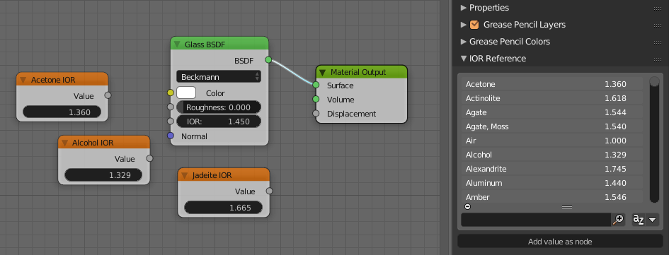

# IOR Reference Addon

IOR Reference is an addon for Blender that adds a list of common IOR values for
materials in the nodes editor. It also includes a button to insert a value node
with the IOR.

And as with all UILists in Blender, you can also search and sort the list by clicking the plus icon at the bottom.

## Instaling

Download the `IOR_reference.py` file and install it from the
addon tab in preferences.

[Check out the Blender manual for more details.](https://docs.blender.org/manual/de/dev/preferences/addons.html#header)
